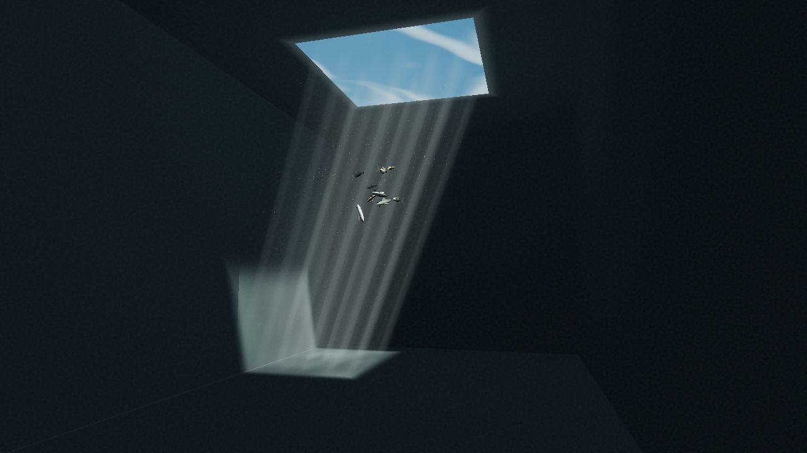
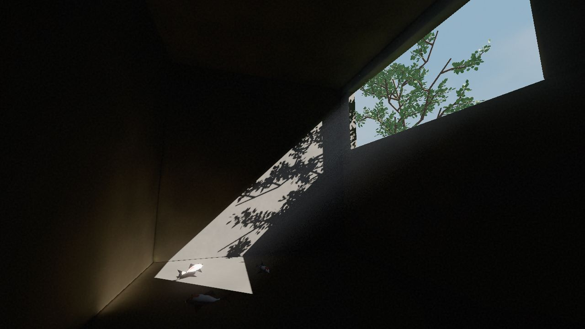
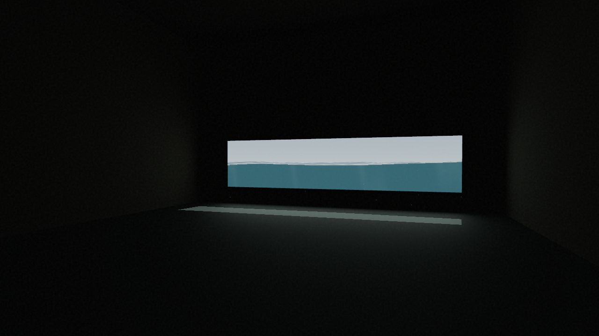

# Quiet Places／靜隅


收集日常裡可以安靜停留的角落。

Quiet Places／靜隅是一組持續增加的即時 WebGL 場景。目前可以走進三個角落：水面把日光拆成波紋、枝葉將午後投進房間，或從窗前望向緩慢起伏的海。



## 場景

| 場景 | 描述 |
| --- | --- |
| 水光之間 | 天窗上方的淺海、室內水光與少量魚群；可切換晴日與雨日。 |
| 樹影午後 | 窗外枝葉、斜向日照、烘焙間接光與近地面錦鯉。 |
| 海光之室 | 從室內觀看程序式海面；可比較窗下、半窗與全淹三種水位。 |





截圖來自本分支的本機預覽，1280×720、正午、標準畫質；海光使用半窗水位。

## 本地啟動

需要 Node.js 22.12+ 與 npm。

```sh
npm ci
npm run dev
```

開啟終端顯示的本機網址。正式建置與預覽：

```sh
npm run build
npm run preview
```

## 操作

- 由「調整空間」切換場景、時段與各場景專屬設定。
- 在畫面拖曳觀看；鍵盤 `←`、`→` 旋轉，`Home` 回到初始視角。
- 可暫停流動、重設視角與使用全螢幕；音訊預設不播放，須手動開始。

## 技術與文件

Vite、TypeScript 與 Three.js。場景以 lazy loading 切換，同一時間只保留一個活躍的 3D 場景。

- [技術架構](docs/ARCHITECTURE.md)與[場景目錄](docs/SCENES.md)
- [水光之間](docs/scenes/waterlight.md)、[樹影午後](docs/scenes/leaflight.md)、[海光之室](docs/scenes/oceanlight.md)
- [材質與光照製作筆記](docs/MATERIALS_AND_LIGHTING.md)
- [本地音樂素材與授權狀態](docs/AUDIO.md)

樹影場景的模型、Blender 母檔與匯出來源記錄於[場景筆記](docs/scenes/leaflight.md)；海光的波浪／光學設計參考及 MIT 授權連結記錄於[海光筆記](docs/scenes/oceanlight.md)。水、光、海浪與焦散均為即時美術或單次光路近似，不是完整流體或全域光照模擬。

## 線上入口與狀態

[開啟 Quiet Places／靜隅](https://quiet-places.zeabur.app/)。主分支合併後由既有部署流程更新；README 截圖對應此 repo 的本機驗證版本，線上版本以部署結果為準。
