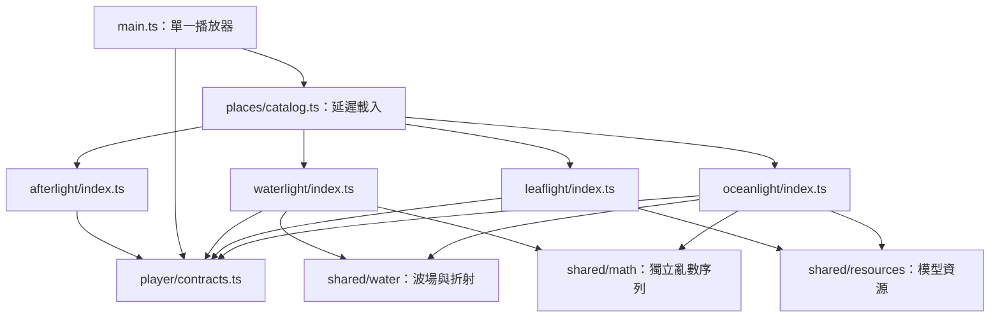

# Quiet Places／靜隅：現行程式結構

四個場景共用一個播放器，場景的構圖、材質與動態各自維護。本頁描述目前程式；集合首頁、hash router 與完整 SceneHost 的舊規劃保留在 [歷史設計](plans/SCENE_HOST_DESIGN.md)，不代表已實作。

## 從哪裡開始

| 想調整的內容 | 入口 |
| --- | --- |
| 網站控制、時段／暫停、鏡頭、匯出 | `src/main.ts` |
| 場景名稱、固定 ID、時刻、水位選項 | `src/places/metadata.ts` |
| 場景載入 | `src/places/catalog.ts` → 各場景 `index.ts` |
| 共用場景契約 | `src/player/contracts.ts` |
| 水光之間 | `src/places/waterlight/` |
| 樹影午後 | `src/places/leaflight/` |
| 海光之室 | `src/places/oceanlight/` |
| 雨後天井 | `src/places/afterlight/` |
| 製作流程與能力索引 | [production](production/README.md) |
| 可跨場景使用的元素 | `src/shared/` |
| 音訊、偏好、時間曲線、GPU 波動系統 | `src/systems/` |
| 原創模型／腳本、網頁資產、人工驗收輸出 | `assets/blender/`、`public/`、`exports/` |



## 已抽出的共同元素

- **場景契約**：`LightingState`、`SceneState`、`PlaceInstance`、`PlaceFactory`。共用型別不再從水光的 `Environment.ts` 匯入。只有播放器提供時間；場景不建立自己的 RAF。鏡頭／曝光／色調映射仍由各場景回傳。
- **水的波場與折射**：`shared/water/Optics.ts` 同時提供 CPU 高度／解析梯度及 GLSL，含 Snell／Fresnel 與兩個水景目前採用的清水吸收設定。現有 `ocean*` 符號保留以維持 shader 相容；波幅和吸收是現有海水外觀的校準，不是所有水體的通用物理常數。
- **模型資源**：`shared/resources/ModelResources.ts` 收集去重的 geometry、material、直接材質貼圖與 skeleton，再由所有者釋放。重複釋放安全；不遞迴掃 shader uniforms，以免誤釋放借用的 photon texture／volume。模型 clone 的獨立 skeleton 仍由 clone 所有者處理。
- **可重現亂數**：`shared/math/seededRandom.ts` 保留既有 LCG 序列；每個場景自己持有 generator 和 seed。魚群、浮塵與雨滴不互相推進亂數狀態。

`TimeOfDay`、偏好與音訊本來就是共用系統，這次沿用。GPU 水波 solver 保留在 `systems/WaterSimulation.ts`；是否使用它由場景決定。

## 保留在各場景的部分

| 水光之間 | 樹影午後 | 海光之室 |
| --- | --- | --- |
| 天窗、淺海厚度、GPU 漣漪 UV 映射、局部焦散、房間光柱與魚群 | Blender 房間、烘焙 indirect EXR、葉影、風、錦鯉暗部补光 | 窗口、水位、石材照明、光子投影、海面與空氣微塵 |

太陽方向、曝光、天窗／窗體座標、天空配色、波光增益都屬於場景校準。樹影烘焙 GI、海光單次傳光與水光局部 Jacobian 的物理近似不同，不合成一個萬用光照 shader。

`waterlight/SurfaceSampling.ts` 合併該場景兩個 shader 的取樣重複；它含3.6m天窗座標與倍率，因此刻意放在場景內。`oceanlight/WindowRoom.ts` 尚保留歷史程序樹影的測試分支；正式樹影入口只使用 `leaflight/index.ts`。`legacy/FloorKoi.ts` 也只供舊稿／回歸測試，不是正式錦鯉。

## 生物與資產接入

魟魚完成版已接入 `oceanlight/index.ts`，模型與動畫在載入時檢查必要 clips。`Stingrays.ts` 管理骨架實例與場景受光，`StingrayMotion.ts` 管理路徑和相位；模型資源所有权沿用 shared。生物資料以[生物文件區](biology/README.md)為入口，詳見[魟魚製作頁](biology/southern-stingray.md)與[海光接入筆記](scenes/oceanlight.md)。歷史缺clips的草稿狀態留在驗收紀錄，已不代表正式入口。

新增場景時：建立 `places/<id>/index.ts`，回傳現有 `PlaceInstance`，在 metadata／catalog 登記；只引用已適合自己的 shared 元素。網頁只需的資產放 `public/`，可編輯來源放 `assets/blender/`。每次沿用材質、樹種或模型後，仍要更新場景筆記與驗收，不因共享程式就宣稱外觀或物理行為相同。

## 驗證入口

```sh
npm test
npm run build
npm run dev
```

`npm test` 使用 Node.js 的 TypeScript stripping，無需額外測試框架。數值與資源測試不取代 browser；場景切換、材質、光影與暫停仍須看實際畫面。

## 2026-09-07：房間導航與轉場

- 右下三個 44px 圓鈕分別開啟「換個房間」、「調整此景」、「關於靜隅」，一次只展開一個面板。時間標示保留左下；Escape／點擊外部可關閉，鍵盤焦點回到入口。房間卡的縮圖為 CSS 意象示意，並非場景截圖。
- 換房間先延遲載入並在獨立 Three.js Scene 建立候選；使用黑色 HTML 遮罩淡出 350 ms，切換並渲染第一幀後淡入 650 ms。reduced-motion 各 80 ms。這是介面美術轉場，未修改任何場景的模型、光照、材質或物理近似。
- 舊房間保留到候選第一幀完成才釋放；載入失敗保留原房間並顯示重新整理提示。切換期間鎖定房間選擇與場景控制，音樂維持連續。候選建立短暫增加資源使用，尚未量測實機記憶體峰值。批次圖片匯出略過淡換。
- Preferences version 1 向後相容增加 rooms，分別儲存時刻／跟隨時間／光束／天候／雨勢／海光水位；音量與畫質共用。原 top-level 偏好用作舊版目前房間的遷移來源。
- 本機驗收：build、單元測試；21 項單元測試通過；瀏覽器樹影 → 海光 → 水光 → 海光切換，恢復 17:30／半窗；390×844、320×568 右下面板、About 連結與 Escape 焦點返回。初次開發模組載入失敗時原房間仍可使用，重新整理後切換成功。本次為本機驗收，未驗證部署；提交紀錄見對應 PR。

## 製作室與資產契約（2026-09-09）

`src/studio/` 為獨立 authoring 入口，共用 Afterlight factory、Medaka 本體、DrainGeometry、SceneClock 和 MusicPlayer。`assets/config/` 保存幾何與已採用 study；`scripts/asset-pipeline.py` 在新目錄重建兩條 pilot；`scripts/study.mjs` 保存候選與可回退的非幾何採用。詳見 [製作入口](production/README.md) 與 [驗收](production/P0_P6_ACCEPTANCE.md)。一般觀賞 UI 不承擔模型製作與實驗紀錄。
