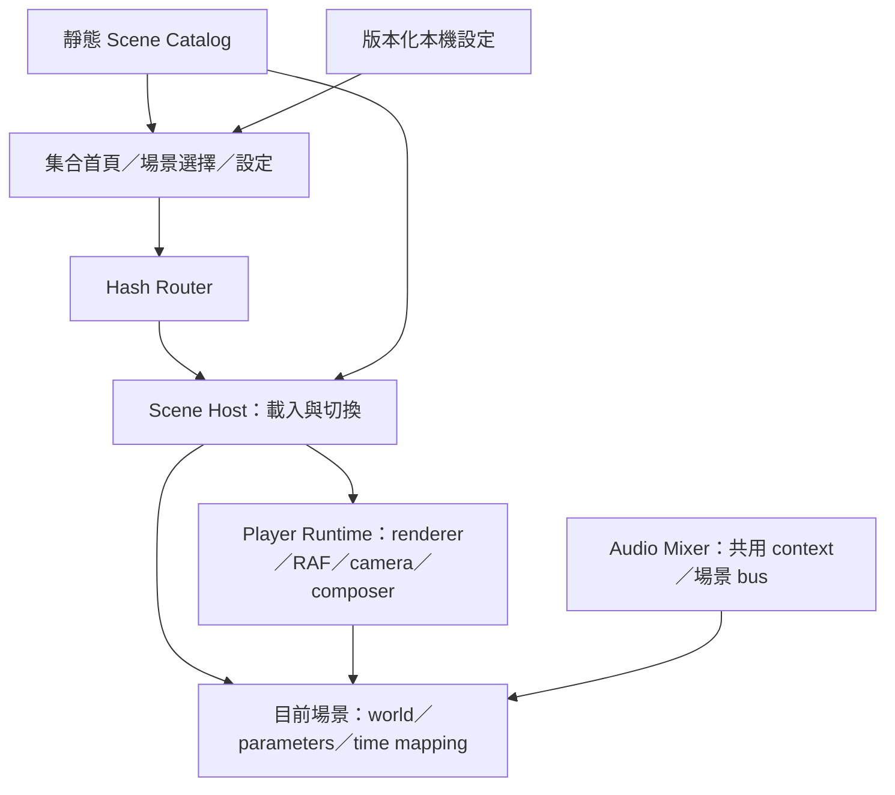

> 歷史設計方案；目前已實作結構以 [ARCHITECTURE.md](../ARCHITECTURE.md) 為準。

# Quiet Places：技術架構與遷移設計

狀態：**部分實作**。`src/places/metadata.ts` 和 `catalog.ts` 已提供三場景 metadata、lazy factory 與共用 runtime 切換；設定可保存場景，八圖匯出已可執行。實際介面見 `PlaceInstance`，實作說明見 [WINDOW_SCENES.md](../WINDOW_SCENES.md)。本文其餘首頁、hash router、淡入淡出、音訊 mixer 與建議目錄仍是後續設計，不能視為已交付。產品流程與交付階段以 [PROJECT_SPEC.md](../../PROJECT_SPEC.md) 為準。

## 1. 主要決策

1. 維持 Vite + TypeScript + Three.js，少量 HTML/CSS UI。三個場景與少量設定暫不需要新增 React、狀態管理框架或後端。
2. 一個頁面只有一個播放器，擁有 renderer、RAF、composer、相機、輸入與共通音訊；同時只有一個活躍場景。
3. 場景獨立提供自然現象、構圖、時間解讀、控制描述及聲音來源，不自行啟動 RAF、建立 renderer 或 AudioContext。
4. 場景目錄只含輕量 metadata 與 `import()` loader；首頁讀取 metadata 與靜態預覽，不 eager import 全部場景。
5. 場景專用效果先留在場景內。至少兩個場景有相同需求時才抽共用 shader；不先追求通用自然模擬器。
6. 切換採遮罩淡出／換景／淡入，不同時渲染兩個 3D 場景交叉淡化。保留目前場景的畫面到新資產準備好。

## 2. 分層與 ownership



| 模組 | 負責 | 不負責 |
|---|---|---|
| App shell | 首頁、場景選擇、狀態提示、焦點、設定 UI | shader、魚群、雨滴 |
| Router | 路由解析、瀏覽器 history、未知 ID | 建構 WebGL 場景 |
| Scene catalog | ID、名稱、availability、預覽、lazy loader | renderer、動態狀態 |
| Scene host | 取消載入、切換序號、狀態機、失敗恢復 | 每幀自然現象 |
| Player runtime | 一個 canvas／renderer／RAF、相機控制、composer、resize、背景生命週期 | 水光專用時間表、UI 名稱 |
| Place instance | 自己的 THREE.Scene、shader／物件、時間映射、場景參數 | 全域 DOM listener、RAF、AudioContext |
| Audio mixer | 一個 AudioContext、master gain、使用者手勢、場景 bus | 認定所有場景都使用水聲 |
| Preferences | 有版本的安全解析與保存、預設值 | 音訊自動播放、雲端同步 |

## 3. 建議目錄（待遷移）

```text
src/
  main.ts                       # 單一啟動入口
  app/                          # shell、router、gallery、controls、preferences
  player/                       # PlayerRuntime、SceneHost、contracts、AudioMixer
  places/
    catalog.ts                  # 輕量目錄與 lazy import
    waterlight/
      index.ts                  # prepare/create adapter
      Environment.ts
      FishSchool.ts
      TimeOfDay.ts              # 現有日夜曲線是水光專用
      audio.ts
    rain-window/                # P3 才建立
    leaflight/                  # P4 才建立
public/
  previews/                     # 已完成場景的靜態預覽
```

不把 `world/` 整體改名成通用 engine；Environment 裡的水面、天空、48-step 體積光皆仍歸 Waterlight。保持水光外觀的抽取先於集合首頁改版。

Catalog 每筆包含穩定 `id`、中英名稱、短句、preview 路徑／alt、`availability: draft | available` 與 lazy loader。只有 available 能出現在首頁與公開路由；draft 只留在設計文件／開發環境。ID 不隨顯示名稱變更。

## 4. 場景契約

以下是設計型別，非可直接使用的現有 API；實作時放入 `player/contracts.ts`，避免文件與程式各自維護兩套型別。

```ts
type Quality = 'low' | 'standard';
type CameraSpec = {
  position: [number, number, number]; target: [number, number, number];
  fov: { desktop: number; portrait: number };
  motion: { kind: 'fixed' } | { kind: 'parallax'; maxOffset: number }
    | { kind: 'orbit'; yawRange: [number, number]; lockPolar: true };
};
type Parameter = {
  id: string; label: string; min: number; max: number; step: number;
  default: number; unit: string;
};
type Frame = {
  dt: number; elapsed: number; hour: number; paused: boolean; quality: Quality;
};
type PlaceInstance = {
  world: THREE.Scene; camera: CameraSpec;
  parameters: readonly Parameter[];
  timeMode: 'local-or-manual' | 'manual' | 'none';
  post: { exposure: number; bloom: { strength: number; radius: number; threshold: number } };
  update(frame: Frame): void;
  resize(viewport: { width: number; height: number; pixelRatio: number }): void;
  setParameters(values: Readonly<Record<string, number>>): void;
  dispose(): void;
};
// 建立期間只可透過 scope 登記資源；create 失敗也可由 host 清理。
type CreateContext = {
  scope: ResourceScope; audio: SceneAudioBus; quality: Quality;
};
type PreparedPlace = {
  create(context: CreateContext): PlaceInstance;
  release(): void; // 釋放尚未交給 instance 的 CPU 資產，須可重複呼叫
};
type PlaceModule = {
  prepare(signal: AbortSignal): Promise<PreparedPlace>; // 不建立 GPU 資源或播音
};
```

`ResourceScope` 是簡單的清理登記簿：登記 geometry/material/texture/render target、listener、timer 的清理函式，以相反順序執行一次。`SceneAudioBus` 是 mixer 分配的 gain 與 source 清理範圍，場景不得關閉全域 context。它們是待實作 helper，不是新增套件。

參數暫只支持數值滑桿；時間、音量、暫停、重設鏡頭是 shell 的專用控制，不以通用表單框架表示。值經各場景 min/max/step 驗證再套用，未知或非有限值丟回預設。

相機設定由 runtime 建立與約束；scene 不在 update 裡偷偷覆寫相機。Waterlight 的 yaw 是相對作者起始方位 ±π/4，保留原俯仰與距離；其他場景不繼承這個操作。

`hour` 只提供裝置時間或手動時刻；場景自行映射亮度、色溫、雨勢、活動速度。`paused=true` 時 dt=0、elapsed 固定，但可重畫參數與鏡頭改動。品質改變先以重建場景處理，保留參數；後續量測再決定哪些效果需熱切換。

## 5. 載入、切換與失敗

狀態：`gallery → preparing → switching → active`，失敗可到 `error`；背景是 active 的 suspended 狀態。載入中的 UI 要顯示目標名稱與取消，不把靜態預覽當作已啟動的場景。

切換 A → B 的順序：

1. 建立遞增 request ID 與 AbortController，取消前一個未完成請求。載入模組並 prepare B 的 CPU 資產，A 仍可用。
2. 回傳時核對 request ID；過期結果立即 release，不得改畫面。dynamic import 本身不能保證取消，必須忽略過期結果。
3. B 準備好後，覆蓋短淡出遮罩（reduced-motion 立即覆蓋），停 A 的輸入、更新及聲音，記錄 A 的 ID／參數。
4. 釋放 A 的場景 scope、音訊 bus、場景 composer passes 與控制 listeners；renderer 與 master audio context 留存。
5. 建立 B 的 scope 與 bus，再 create B、套參數／相機／passes、resize，先成功繪製一幀，再淡入並交還焦點。不要同時保留 A、B 的完整 GPU 場景。
6. create／第一幀失敗則清理 B，嘗試重新載入 A 與其設定；若仍失敗，回首頁提供錯誤與重試。不能承諾舊 scene 在釋放後仍可原樣恢復。

Gallery↔scene 同樣遵守釋放規則。準備 CPU 資產也可能佔大量記憶體，初版只保留當次目標，不預抓全部場景。計時器／動畫統一由 runtime 管理，避免切換後累積 `requestAnimationFrame`。

## 6. Rendering、音訊與無障礙

- Runtime 先 update、再 render；各場景只回傳 world 與 post 設定。Waterlight 的 raymarch 材質保留在 Environment，不放進全域 renderer。
- Composer 由 runtime 持有，切換需 dispose 舊 passes／render targets，重新綁定 world/camera、套 exposure。不要讓上一場景的 bloom 汙染下一場景。
- 保留色彩空間／tone mapping 的共通基線，場景可宣告 exposure／bloom；不能統一調暗到破壞已接受的耶穌光。
- 每個場景創建聲音 sources 到自己的 bus；離開時先 gain 淡出，再 stop/disconnect sources。關閉頁面才 close 共用 AudioContext。
- 背景分頁暫停 RAF 與音訊；回前景重設時間差，不補算長時間跳躍。場景仍由使用者選擇是否繼續流動。
- 瀏覽器 context lost 顯示可恢復狀態，停止迴圈，保留場景 ID／參數；重建失敗給靜態 fallback 與回首頁。
- 鍵盤事件只在相關控制／canvas 焦點生效；左右鍵調 slider 時不得旋轉鏡頭。關閉選擇層恢復原觸發按鈕焦點。
- 全螢幕只由手勢啟動；不支持時留在一般視窗。觸控縮放與單指操作按相機模式定義，選擇層／設定可正常捲動。

## 7. 效能與公開資產

首頁維持零活躍 3D 場景；同一時刻只載入目前／正在準備的目標。低品質先限制 pixel ratio 並降低各場景主要昂貴效果（例如 volume steps），具體值由實機測試決定，不先宣稱達成 60 fps。

自動降品質先不做；初版採使用者選擇的 low/standard，並提供載入失敗重試。記錄至少一台桌面與一台實體手機、瀏覽器版本、幀時間及資源趨勢，測試目標見集合規格。

未取得外部素材前優先程序式內容。新增素材時在文件記錄來源、作者、license、修改與署名需求。`docs/references/` 是使用者提供的創作參考，公開 repo 前確認是否適合散布；改成不追蹤現有檔案不會移除歷史 commits 中的內容。公開 repo 與選擇開源授權是兩個決策，不自動指定 MIT。

## 8. 從現況遷移

| 現況證據 | 遷移方式 | 不能遺失的驗收 |
|---|---|---|
| `src/main.ts` 將 renderer、RAF、DOM、OrbitControls、時間與場景綁在 start | 拆 runtime／shell，再以 Waterlight adapter 接現有 factory | 初始構圖、90° 邊界、重設、暫停與 slider |
| `world/Environment.ts` 混合水、天空、焦散、volume | 先原樣保留，只有包 adapter | 強光、透明天空、左右端點光影 |
| `world/FishSchool.ts` 接收水光 LightState | 留在 Waterlight 專用 | 9 魚、邊界與 dispose |
| `TimeOfDay.ts` 包含水光曲線與 momentName | 移入 Waterlight；只抽通用時鐘／時間格式 | 14:00 初始與 local/manual 語意 |
| `AudioSystem.ts` 自己建立並 close context | 拆 master mixer 與場景音源 bus | 手勢解鎖、靜音、跨場景無殘留音 |
| main 全域事件與 idle timer 無場景 teardown | runtime 全域 listener 一次註冊；輸入 scope 隨場景回收 | 20 次切換沒有重複事件或游離 RAF |

以 `b0e28cd` 作為水光外觀與操作基準；更早的 `v0.1-water-sky` 保留。先做 P1 並確認行為一致，再加首頁。這份設計不代表已執行上述重構，也不需要為文件重跑無關的 GPU 測試。


### 原始碼盤點依據

- [main.ts](../../src/main.ts)：14–77 行為單一啟動 closure；41–43 行建立綁定同一 world/camera 的 composer；52–76 行事件與頁面級清理。
- [Environment.ts](../../src/places/waterlight/Environment.ts) 與 [FishSchool.ts](../../src/places/waterlight/FishSchool.ts)：factory 即刻掛入 Scene，只有 update／dispose，沒有場景 metadata 或切換 API。
- [AudioSystem.ts](../../src/systems/AudioSystem.ts)：context 的生命週期由單一水光系統持有；集合需要把全域 context 與每場景 sources 分開。
- [TimeOfDay.ts](../../src/systems/TimeOfDay.ts)：純函式可保留，但四欄 LightState 與時段文案是水光專用，不作為所有場景的統一狀態。

這些是目前單場景程式的結構限制，並不代表現有單場景正在累積資源；風險發生在直接重跑 start() 作為換景策略時。
